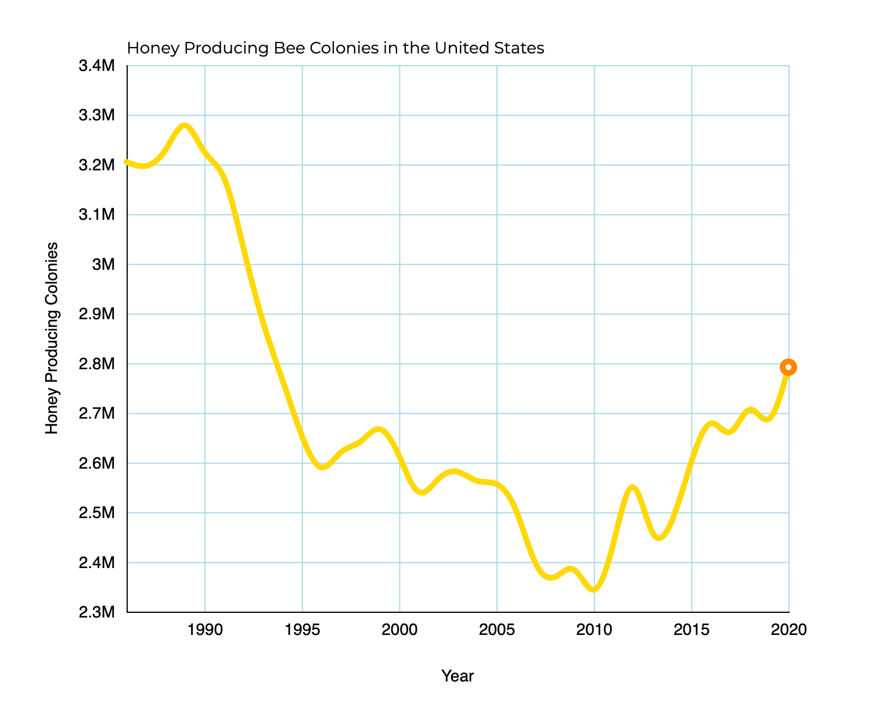

# Save the Honey

Save the Honey is an interactive visualization of bee populations in recent years. It was built completely on the frontend using **JavaScript** and **D3**. It currently shows a graph of honey producing bee colonies through the years.

Future Features:
* Clicking on a year will show a graph of data from individual US states in the selected year.
* Mousing over on the graph will show exact numbers of that year.
* Honey yield from each year can be seen.
